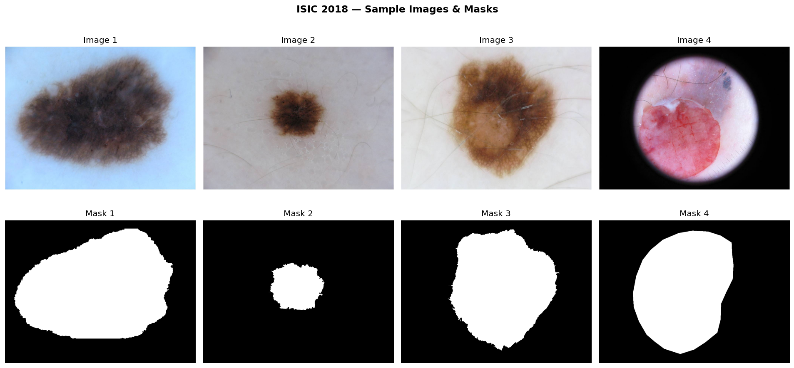
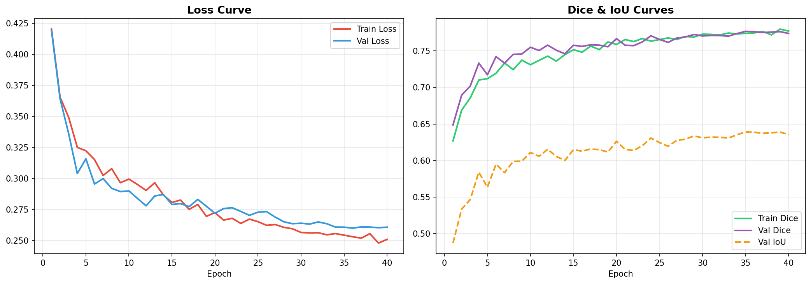
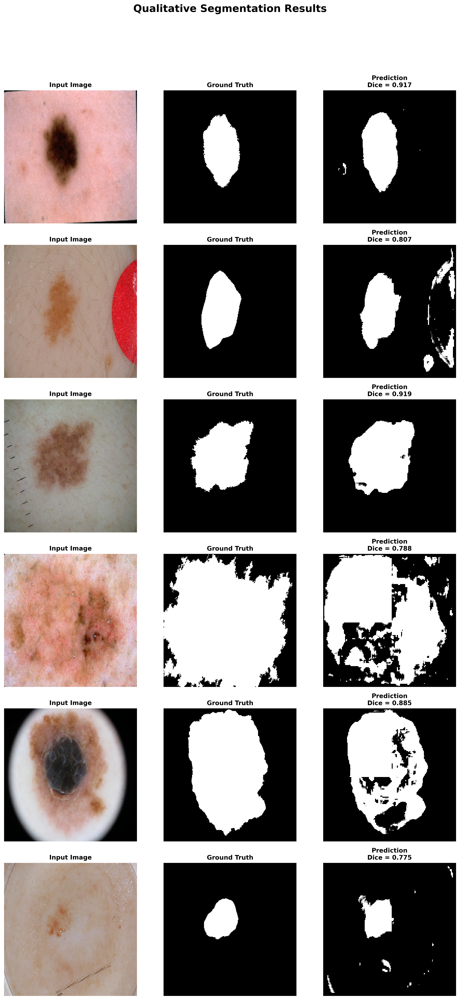

# 🔬 Skin Lesion Segmentation — ResNet-34 U-Net

Automated binary segmentation of skin lesions in dermoscopy images, trained on the ISIC 2018 Task 1 dataset.

**Live demo →** [🤗 Hugging Face Spaces](https://huggingface.co/spaces/DevNajmi/skin-lesion-segmentation)  
**Code →** [GitHub](https://github.com/NajmiHassan/SkinSeg-Vision)

---

## Model Description

A U-Net architecture with a ResNet-34 encoder pre-trained on ImageNet, fine-tuned end-to-end for binary skin lesion segmentation. Given a dermoscopy image, the model produces a pixel-wise binary mask distinguishing lesion from background.

**Architecture highlights:**
- Encoder: ResNet-34 (ImageNet pre-trained) — captures rich multi-scale features
- Decoder: Transposed convolution upsampling with skip connections — preserves spatial detail
- Loss: BCE + Soft Dice (0.5 / 0.5) — balances pixel accuracy with region overlap
- Mixed precision training (torch.cuda.amp) for efficiency

---

## Training Data

[ISIC 2018 Challenge — Task 1: Lesion Segmentation](https://challenge.isic-archive.com/landing/2018/)

~2,594 dermoscopy images with expert-annotated binary segmentation masks covering diverse lesion types, sizes, and acquisition conditions.

### Sample data



*Each column shows a dermoscopy image (top) and its corresponding expert-annotated binary mask (bottom).*

---

## Training Details

| Parameter | Value |
|-----------|-------|
| Input size | 256 × 256 |
| Epochs | 40 |
| Batch size | 16 |
| Optimizer | AdamW |
| Learning rate | 3e-4 |
| Weight decay | 1e-4 |
| LR scheduler | Cosine Annealing |
| Loss function | BCE + Soft Dice (0.5 / 0.5) |
| Precision | Mixed (torch.cuda.amp) |
| Train / Val split | 85% / 15% |

**Augmentations:** HorizontalFlip, VerticalFlip, RandomRotate90, ShiftScaleRotate, ColorJitter, GaussNoise

### Training curves



*Left: Loss curves — train and val converge closely with no overfitting. Right: Dice and IoU curves — val Dice plateaus around 0.84 by epoch 40.*

Key observations:
- Loss drops sharply in the first 5 epochs then converges smoothly
- Train and val loss stay closely aligned throughout — no overfitting
- Val Dice improves steadily and stabilises, indicating good generalisation

---

## Evaluation Results

Evaluated on a 15% held-out split (~390 images) not seen during training.

| Metric | Score |
|--------|-------|
| Val Dice / F1 | **0.84** |
| Val IoU (Jaccard) | **0.64** |

### Qualitative predictions



*Each row shows: input dermoscopy image · ground truth mask · predicted mask with per-sample Dice score.*

Per-sample Dice scores from the qualitative examples: **0.917, 0.919, 0.885, 0.807, 0.788, 0.775**

The model performs well on typical lesions (Dice > 0.90) and degrades on challenging cases such as low-contrast boundaries, large diffuse lesions, and images with strong acquisition artefacts (ruler, ink marks, circular vignetting).

---

## How to Use

### Install dependencies

```bash
pip install torch torchvision albumentations huggingface_hub Pillow numpy
```

### Run inference

```python
import torch
import numpy as np
from PIL import Image
import albumentations as A
from albumentations.pytorch import ToTensorV2
from huggingface_hub import hf_hub_download
from src.model import UNet

# Download weights from Hub
ckpt_path = hf_hub_download(
    repo_id="DevNajmi/skin-lesion-segmentation-unet",
    filename="best_model.pth"
)

device = torch.device("cuda" if torch.cuda.is_available() else "cpu")
model  = UNet(pretrained=False).to(device)
ckpt   = torch.load(ckpt_path, map_location=device)
model.load_state_dict(ckpt["model_state"])
model.eval()

transform = A.Compose([
    A.Resize(256, 256),
    A.Normalize(mean=(0.485, 0.456, 0.406),
                std =(0.229, 0.224, 0.225)),
    ToTensorV2(),
])

# Predict
image = np.array(Image.open("your_image.jpg").convert("RGB"))
inp   = transform(image=image)["image"].unsqueeze(0).to(device)

with torch.no_grad():
    mask = (torch.sigmoid(model(inp)) > 0.5).float()

# mask shape: (1, 1, 256, 256) — values 0 or 1
```

---

## Limitations

- Trained exclusively on dermoscopy images — will not generalise to other imaging modalities (histology, ultrasound, etc.)
- Performance degrades on images with large acquisition artefacts (rulers, ink markers, heavy vignetting)
- Not validated for clinical use — **this model is not a medical device**
- Evaluated on ISIC 2018 only; performance on other dermoscopy datasets may differ

---

## Intended Use

| ✅ Appropriate | ❌ Not appropriate |
|---|---|
| Research and experimentation | Clinical diagnosis |
| Benchmarking segmentation methods | Medical decision-making |
| Educational demonstration | Deployment without clinical validation |
| Pre-processing step in research pipelines | Any safety-critical application |

---

## Citation

If you use this model in your work, please cite:

```bibtex
@misc{devnajmi2026skinlesion,
  author    = {Najmi},
  title     = {Skin Lesion Segmentation with ResNet-34 U-Net on ISIC 2018},
  year      = {2026},
  publisher = {Hugging Face},
  url       = {https://huggingface.co/DevNajmi/skin-lesion-segmentation-unet}
}
```

**Dataset:**
```bibtex
@article{tschandl2018ham10000,
  title   = {The HAM10000 dataset, a large collection of multi-source dermatoscopic images of common pigmented skin lesions},
  author  = {Tschandl, Philipp and Rosendahl, Cliff and Kittler, Harald},
  journal = {Scientific data},
  volume  = {5},
  pages   = {180161},
  year    = {2018}
}
```

---

## Acknowledgements

- [ISIC Archive](https://www.isic-archive.com/) for the dataset
- [torchvision](https://pytorch.org/vision/) for the ResNet-34 backbone
- [Albumentations](https://albumentations.ai/) for augmentation
- [Streamlit](https://streamlit.io/) for the demo UI
